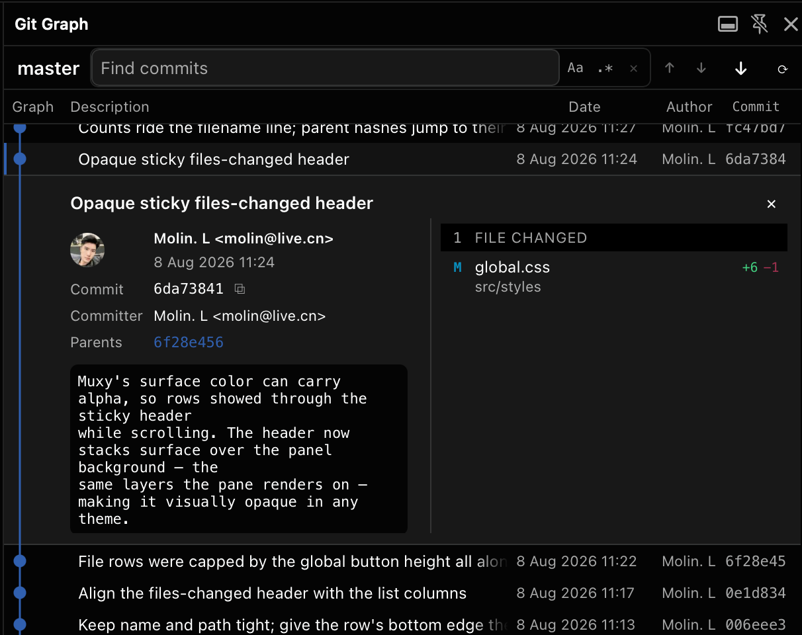

# Git Graph

View a Git graph of your repository, and act on it — a Muxy port of
[mhutchie's Git Graph for VS Code](https://github.com/mhutchie/vscode-git-graph)
(MIT). Independent project, not endorsed by or affiliated with mhutchie. See
[`NOTICE`](./NOTICE).

Opens in the **right panel** with `cmd+shift+g`.

## Requirements

**Muxy `1.5.0-beta.912-arm64`.** The extension depends on APIs from this build —
notably the background-context exec relay it needs for remote workspaces
([ADR-0017](./docs/adr/0017-background-exec-relay.md)). Older builds are not
supported.

## Features

- **The graph** — local and remote branches, tags, stashes, uncommitted changes,
  merge lanes, HEAD highlighting. Loads 300 commits and pages as you scroll.
- **Click a commit** to expand its details inline, git-graph style: author,
  committer, date, parents, message body, and the list of changed files. The graph
  stretches around the expansion.
- **Click a file** to open its diff in a tab, with a unified/split toggle.
- **⌘/Ctrl-click two commits** to compare them. The first click only marks its
  row — nothing expands, since one end of a range has nothing to show — and the
  second opens the changed files across the pair beneath it. With a commit already
  expanded, a single ⌘/Ctrl-click compares against it.
- **Right-click a commit** for Add Tag, Create Branch, Checkout, Cherry Pick,
  Revert, Drop, Merge, Rebase, Reset, and copy actions — with Cherry Pick and Drop
  correctly disabled on merge commits.
- **Right-click a ref** for branch, remote-branch, tag and stash menus.
- **Right-click uncommitted changes** to stash, reset, or clean.
- **In-progress banner** with Abort and Continue when a merge, rebase, cherry-pick
  or revert is mid-flight — something upstream git-graph does not have.
- **A search field in the topbar**, always there — type and matches highlight as
  you go, across subjects, authors, hashes, branch and tag names, dates and stash
  selectors, with match-case and regex toggles. `⏎`/`⇧⏎` step through matches
  without disturbing the selection.
- **Keyboard** — `⌘R` refresh, `⌘H` scroll to HEAD, `⌘F` jump to the find bar,
  `⌘G`/`⇧⌘G` next and previous match, `↑`/`↓` move the selection, `Esc` clear the
  search, then close the details pane, `⌥⌘L` verbose logging.
- Columns drop as the panel narrows, so it stays usable at any width.

## Building

```sh
npm install
npm run build
```

Then **Load Unpacked** this folder in Muxy's Extensions modal, or **Reload** if it
is already loaded. A Reload alone will not pick up unbuilt source.

```sh
npm test              # layout snapshots + data layer against a real repo
npm run test:update   # regenerate snapshots — then READ them (ADR-0012)
npm run typecheck
```

## Layout

| Path | |
|---|---|
| `src/graph/` | Lane geometry. Pure, DOM-free, snapshot-tested. Ported from upstream. |
| `src/data/` | Every git read and write. |
| `src/view/` | Panel, virtualised rows, details, menus, dialogs. |
| `src/actions/` | Context-menu definitions. |
| `src/diff/` | Diff tab and unified-diff parser. |
| `src/log.ts` | The log, which is `console`, which is Muxy's Extension Output panel. |
| `docs/adr/` | Why everything is the way it is. Read `0001` first. |
| `CONTEXT.md` | Glossary. Lane, Vertex, Ref, Commit Feed, Graph Tab. |

## Design decisions

Twenty ADRs in [`docs/adr/`](./docs/adr/). The ones that will surprise you:

- **[0002](./docs/adr/0002-data-layer-split.md)** — reads go through `muxy.exec`,
  writes through `muxy.git`. Split by intent, not capability.
- **[0005](./docs/adr/0005-typescript.md)** — TypeScript, alone among Muxy
  extensions, to de-risk the geometry port.
- **[0007](./docs/adr/0007-virtualise-rows-not-graph.md)** — rows virtualise, the
  graph does not. Includes what was measured, and where the reasoning was wrong.
- **[0013](./docs/adr/0013-no-background-script.md)** — no `background.js`, despite
  there being a polling loop.
- **[0014](./docs/adr/0014-right-panel-not-tab.md)** — right panel, superseding the
  tab decision in ADR-0003.
- **[0018](./docs/adr/0018-find-matches-the-feed-not-the-dom.md)** — find searches
  the commit data, never the DOM, and highlights as rows render.
- **[0019](./docs/adr/0019-warm-graph-per-project.md)** — switching projects paints
  a cached graph and revalidates behind it. A whole repaint is one command.

## Watching what it does

Open Muxy's **Extension Output** panel (View → Toggle Extension Output). Every line
this extension writes lands there, tagged with the surface that wrote it:

```
[git-graph:panel] panel starting extension=git-graph verbose=false
[git-graph:panel] binding to project key=/Users/dev/gateway warm=true
[git-graph:panel] probing how git can be reached key=/Users/dev/gateway
[git-graph:panel] probe direct: ok sent="git --version" detail="git version 2.51.0"
[git-graph:panel] transport settled via=direct key=/Users/dev/gateway
[git-graph:panel] graph reloaded key=/Users/dev/gateway commits=300 via=direct ms=181
```

By default only milestones are logged — a project bound, a transport rung settled, a
reload finished, an action failed — so an idle panel stays quiet in a panel shared
with every other extension. Press **`⌥⌘L`** in the graph panel for per-command
detail: every `exec` with its transport, exit code and duration, and every relay
round trip. The toggle persists, so the diff tab and the next reload stay verbose
until you press it again.

See [ADR-0020](./docs/adr/0020-log-to-muxys-extension-output.md) for why `console`
is the channel.

## Remote (SSH) workspaces

Webview `muxy.exec` always spawns on the machine running Muxy, so it cannot reach a
remote worktree. The extension ships a `background.js` exec relay: the background
context is the one Muxy documents as running exec on the remote server, and every
git command rides it when the webview's own exec cannot reach the repository
([ADR-0017](./docs/adr/0017-background-exec-relay.md)). Each relayed command is
pinned to the repository the panel resolved (`cd <root> && …`), so a shared
background host cannot contaminate one project's graph with another's. If the
relay cannot reach the right repository either, the panel degrades to read-only
history via `muxy.git`, and the probe report is persisted to
`storage["diagnostics.lastProbe"]` for diagnosis.

## Not yet built

The repository settings widget (remotes, issue linking), avatars, code-review
tracking, and configurable settings. See
[ADR-0004](./docs/adr/0004-v1-includes-destructive-actions.md) for the tier
breakdown, and [`docs/spike-findings.md`](./docs/spike-findings.md) for the one
open architectural risk.
